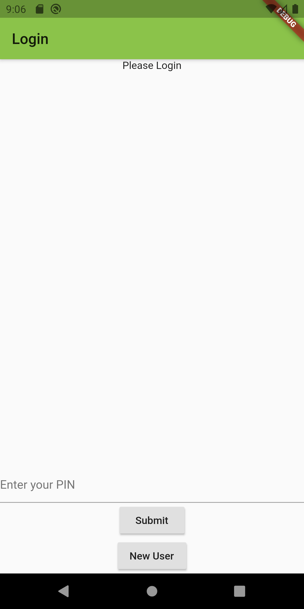
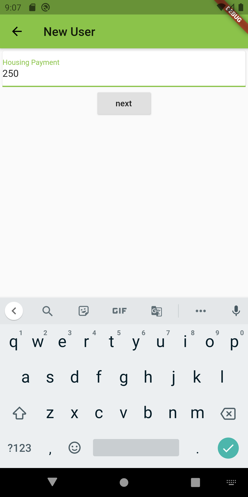
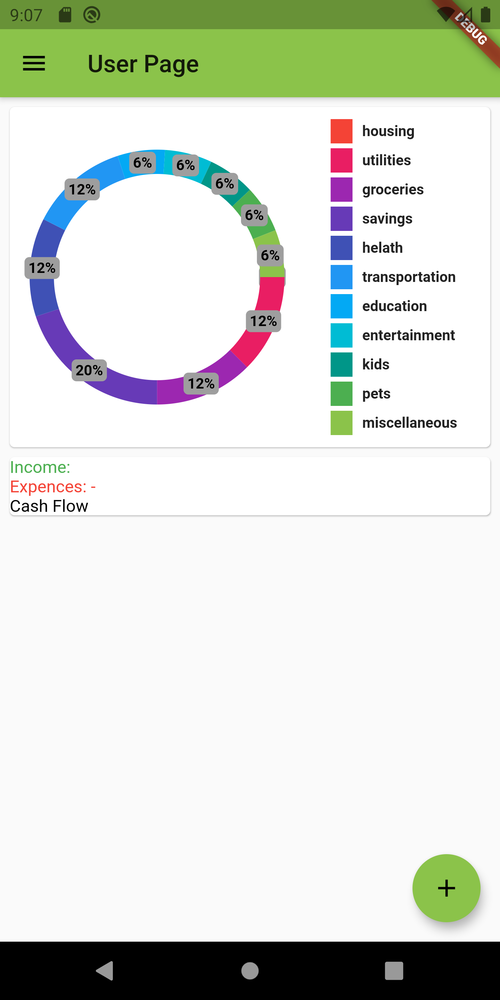
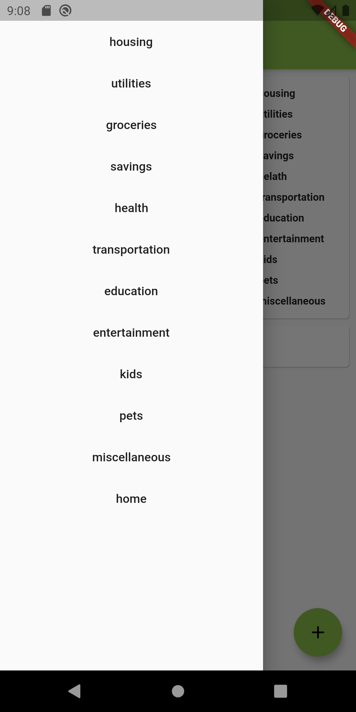

User manual for the average user of the system (User.md)

```
Explaining the features of the system and how to do them step-by-step
Testing criteria: A regular user should be able to use the features of your running project by just following this document.
```

User manual
===========

1.	Launch application
2.	Tap on 'New User' button
*new user button is at the bottom of screen*
3.	Fill out forms as they direct
*example of entry point*
4.  once you get through the form youll see the pie chart
*pie chart of budget*
5.  Interact with the side menu to go to different categories
*category options*

Demo Video
==========
[Video on showing use](https://youtu.be/P_akw7ZwrjA)
