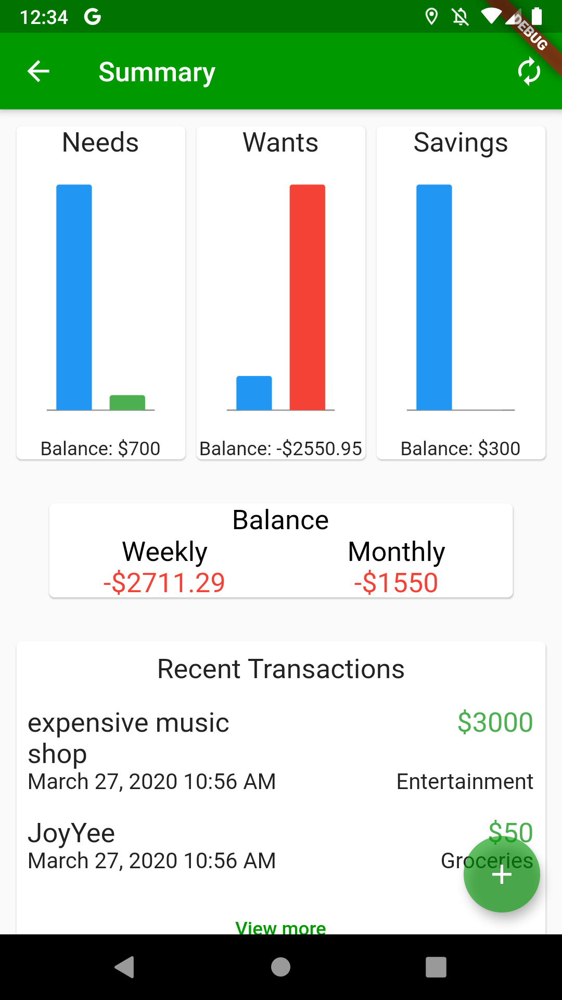

User manual for the average user of the system (User.md)

<--(Explaining the features of the system and how to do them step-by-step
Testing criteria: A regular user should be able to use the features of your running project by just following this document.)-->

User manual
===========

1.	Launch application
2.	If you are a new User you'll be greeted with this just fill out the requested information
>  *information collection fields*
3.	If you are a returning user you will see this screen just enter your pin for your account and it will load your information
> 
4.  once you get through the form youll see the Home page this displays the pie chart of the budget, your section allotments, cashflow for the current month, and the transactions for the month.
> 
*pie chart of budget*
5. If you press the Plus sign it will direct you to this page which will allow you to add transactions that have been made
> 
*Transation adding page*
6. Interact with the side menu to go to different categories, you can also ctap on the <em>Needs, Wants or Savings</em> sections of the home page and it will direct you to the change screens as well
> 
*category options*
7. the Side menu options will direct you to a page that looks like this:
> 
*this is the Wants section Page*

Demo Video
==========
[Video on showing use](https://youtu.be/Blm0Ip45sQE) *demo of use for thoes that want to see it in action*
