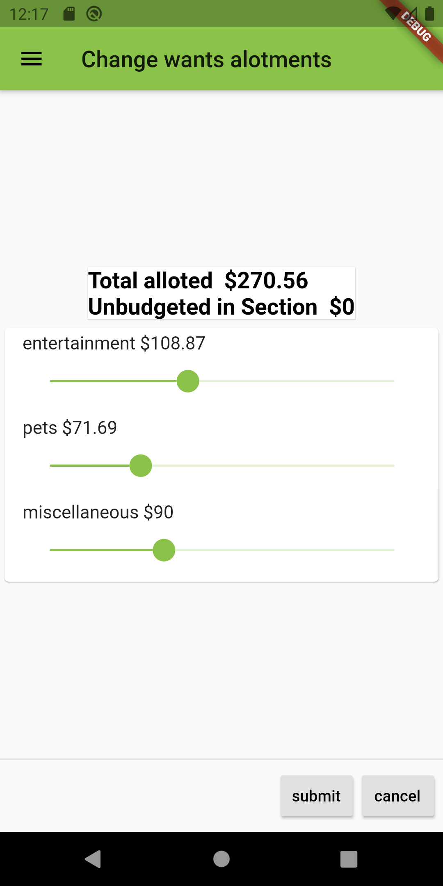

User manual
===========

1.	Launch application
2.	If you are a new User you'll be greeted with this just fill out the requested information > 
3.	Then it will Ask if you want to input more information or if you want to get started. > 
4.	If you are a returning user you will see this screen just enter your pin for your account and it will load your information > 
5.	Once the app has loded you will see your UserPage > 
6.	You can select the one of the graphs and it will direct you to the visual of the categories. > 
7.	From the visual of the categories you can go to the change allotment screen where if you think you need to change an alloted amount you can > 
8.	From the User page if you select the veiw more transactions you will go to a list of all your recorded transactions and a display of your remaining budgets > 
9.	If for some reason you want to change details of a transaction select the transaction and it will direct you to an edit transaction page. > 
10.	If at any point you want to start over you can select the refresh button in the corner and remove your data and start with an all new data > 

Demo Video
==========

[Video on showing use](https://youtu.be/y2a_lkeqrvc) *demo of use for those that want to see it in action*
